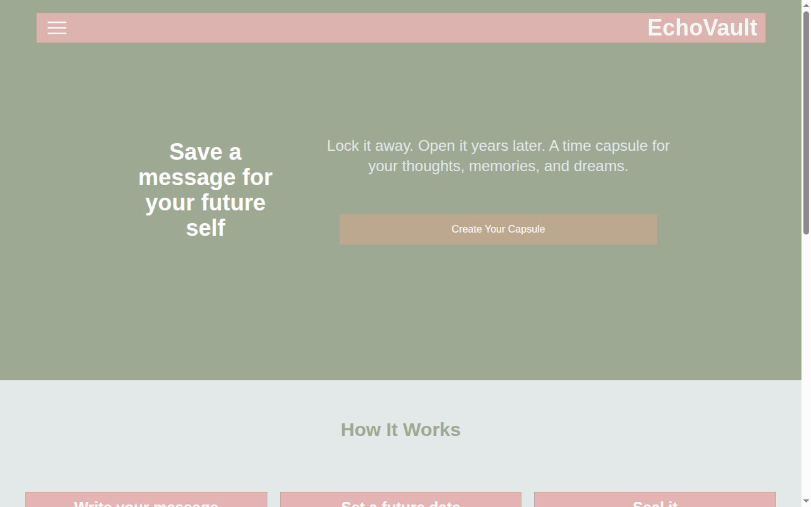

# EchoVault

EchoVault is a time capsule website that allows users to add their data to a digital capsule, which will only open after a specified period of time.

## Features

- Create personal or shared time capsules
- Set custom unlock dates for each capsule
- Secure and private data storage
- User-friendly web interface

## Getting Started

1. Clone the repository:
    ```bash
    git clone https://github.com/yourusername/EchoVault.git
    ```
2. Follow the setup instructions in the [INSTALL.md](INSTALL.md) file.

## Screenshot



## License

This project is licensed under the MIT License. See the [LICENSE](LICENSE) file for details.